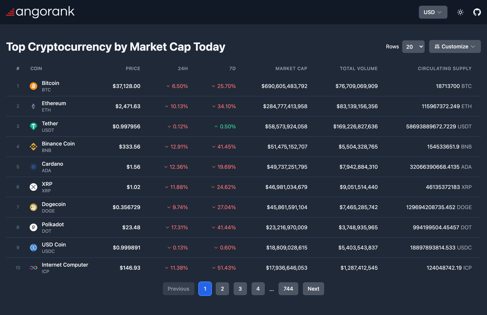

<div align="center">
  
  <br />
  <br />
  <p>Cryptocurrencies ranked by market cap & trading volume</p>
  <small><em>暗号(Angō): Crypto in Japanese</em></small>
</div>

# Angorank

[Live Demo - https://angorank.vercel.app](https://angorank.vercel.app)

This is a [Next.js](https://nextjs.org/) project bootstrapped with [`create-next-app`](https://github.com/vercel/next.js/tree/canary/packages/create-next-app).

## Local development

For local development run:

```bash
npm run dev
```

Open [http://localhost:3000](http://localhost:3000) with your browser to see the result.


